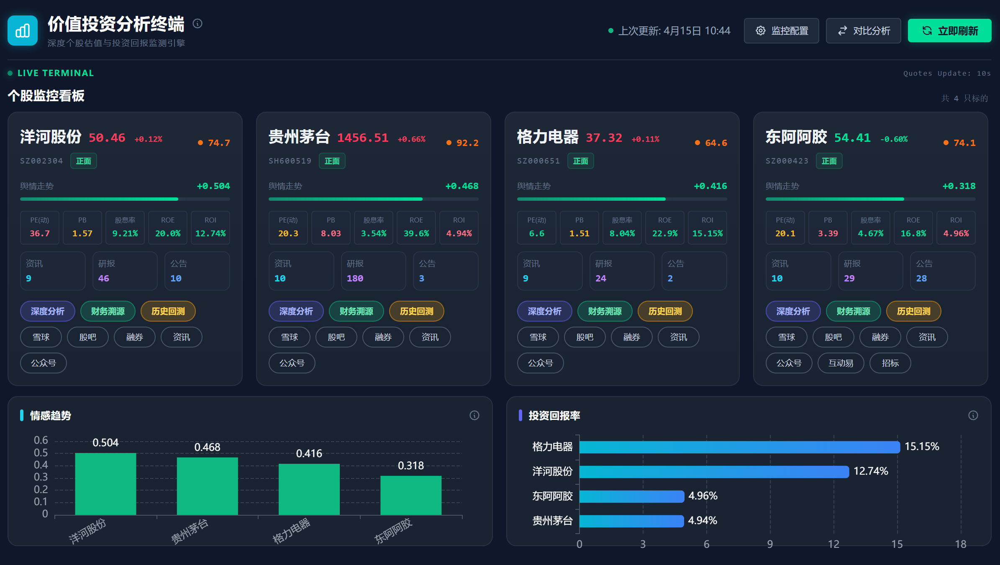
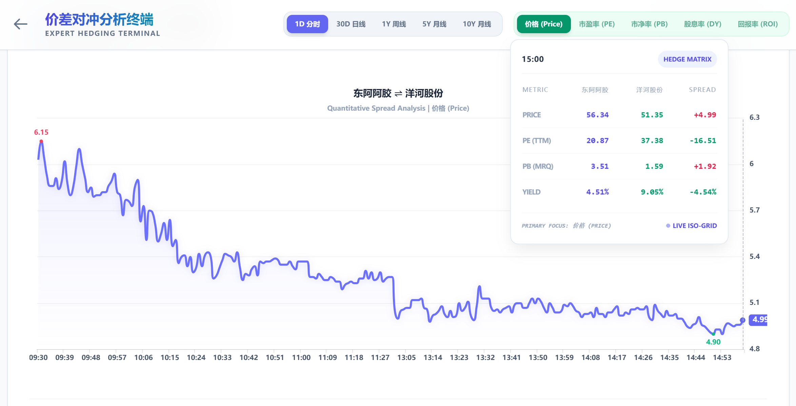
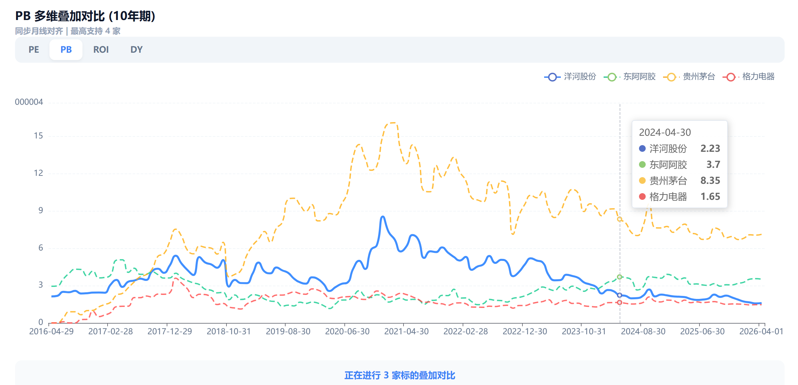

# Sentiment Monitor

面向 A 股的研究终端，聚合了实时行情、舆情采集、估值分析、历史回测和财务溯源能力。

当前版本已经从“舆情看板”扩展为一套可直接用于个股研究的分析工作台：

- 首页看板：监控股票列表、实时价格、最新舆情数据
- 个股详情页：单股舆情明细、公告、研报、新闻
- 对比分析页：多标的实时/历史估值与价格对冲对比
- 条件选股页：基于 SQLite 本地快照的 PB / PE / ROE / 股息率组合筛选
- 深度分析页：10 年分位、F-Score、估值结论层、多模型估值、Investment Thesis
- 历史回测页：历史区间回放、收益分析、信号相关性
- 财务溯源页：现金流质量、资本配置、经营稳定性、股价与股东人数对比

## 项目展示

| 首页看板 | 对比分析 | 深度分析 |
| --- | --- | --- |
|  |  |  |

## 最新进展

- 条件选股页已上线：基于 SQLite 本地快照做全市场筛选，支持 PB / PE / ROE / ROI / 股息率 / 总市值组合过滤
- 选股页指标口径已校正：ROE 优先取年报口径，股息率按当前价格对应的现金分红收益率计算
- 财务溯源页已将“股价与股东人数对比”上移至页面最上方，并保留最稳定的股东统计日股价 + 股东户数双轴展示
- 前端 API 已统一走相对路径 `/api`，开发和部署环境的接入方式更一致

## 路线图

- 价值分析后续开发路线图见 [docs/plans/2026-04-16-value-analysis-roadmap.md](/d:/code/git/sentiment_monitor/docs/plans/2026-04-16-value-analysis-roadmap.md:1)

## 主要能力

### 1. 实时行情与舆情

- 监控股票池支持增删改查
- 批量获取实时价格、PE、PB、股息率、市值
- 聚合新闻、研报、公告，并沉淀情绪分数和热度分数

### 2. 深度分析

- 10 年历史分位矩阵：PE / PB / ROI / 股息率
- F-Score 安全性排雷
- 估值结论层
  - 合理价值区间
  - 折价 / 溢价
  - 安全边际
  - 预期年化回报拆解
- 多模型估值
  - ROE-PB 锚点
  - 盈利能力估值
  - 股东自由现金流估值
- Investment Thesis 跟踪
  - 买入理由
  - 核心假设
  - 风险清单
  - 财报后复核项

### 3. 财务溯源

- 股价与股东人数对比
  - 优先展示近 10 年窗口
  - 当前图表只保留“股东统计日股价 + 股东户数”，不再叠加融资和外资口径
- 现金流质量矩阵
  - CFO
  - FCF
  - CFO / 净利润
  - FCF / 净利润
  - Capex 强度
  - FCF 收益率
- 资本配置分析
  - ROIC 代理
  - 再投资率
  - 留存率
  - 股本变动
  - BVPS 增长
- 经营稳定性分析
  - 收入增速波动
  - 毛利率 / 净利率波动
  - ROE / ROIC 代理波动
  - 周期性标签
  - 护城河与经营稳定性标签
- 杜邦 ROE 拆解、盈利护城河追踪、股东回馈矩阵

### 4. 条件选股

- 基于 SQLite 本地快照做全市场筛选，不影响现有分析链路
- 支持 PB / PE / ROE / ROI / 股息率 / 总市值等组合条件
- 默认剔除异常估值样本，可手动切换纳入
- 提供“低估高股息 / 高 ROE 价值 / 现金奶牛”等常用预设
- 结果可直接加入监控列表，或跳转到深度分析页继续研判

### 5. 历史回测

- 个股历史估值回放
- 收益拆解
- 信号相关性分析

## 技术栈

| 层 | 技术 |
| --- | --- |
| 后端 | Django 4.x, Django REST Framework, SQLite |
| 前端 | Vue 3, TypeScript, Vite, Pinia, Vue Router, ECharts, Tailwind CSS |
| 数据源 | 腾讯财经接口、东方财富、AkShare、新浪财经兜底 |
| 缓存 | Django file-based cache + DataFrame 文件缓存 |

## 项目结构

```text
sentiment_monitor/
├─ backend/
│  ├─ api/                    # 核心业务服务、REST API、缓存管理、测试
│  ├─ collector/              # 舆情采集逻辑
│  ├─ scripts/                # 诊断、迁移、验证等非运行时脚本
│  ├─ sentiment_monitor/      # Django 项目配置
│  ├─ cache_data/             # 文件缓存目录
│  ├─ manage.py
│  └─ requirements.txt
├─ frontend/
│  ├─ src/
│  │  ├─ api/                 # Axios 封装
│  │  ├─ components/          # 页面组件
│  │  ├─ router/              # 前端路由
│  │  ├─ stores/              # Pinia 状态
│  │  └─ views/               # Dashboard / Detail / Compare / Screener / Analysis / History / Quality
│  ├─ package.json
│  └─ vite.config.ts
├─ legacy/                    # 历史文件或旧实现
├─ start.bat                  # Windows 一键启动脚本
└─ README.md
```

## 页面与路由

| 页面 | 路由 | 说明 |
| --- | --- | --- |
| 首页看板 | `/` | 股票池、实时价格、舆情总览 |
| 个股详情 | `/stock/:symbol` | 单股舆情明细 |
| 对比分析 | `/compare` | 多标的实时/历史对比 |
| 条件选股 | `/screener` | 基于 SQLite 快照的 PB / PE / ROE / 股息率组合筛选 |
| 深度分析 | `/analysis/:symbol` | 分位、F-Score、估值结论层、多模型估值、Thesis |
| 历史回测 | `/analysis/:symbol/history` | 历史回放与收益分析 |
| 财务溯源 | `/quality/:symbol` | 现金流、资本配置、稳定性、股东人数 |

## 核心接口

### 股票与采集

- `GET /api/stocks/`
- `POST /api/stocks/`
- `DELETE /api/stocks/{symbol}/`
- `POST /api/collect/`

### 舆情与行情

- `GET /api/sentiment/latest/`
- `GET /api/sentiment/today/`
- `GET /api/sentiment/realtime_prices/`
- `GET /api/sentiment/search/?q=...`
- `GET /api/sentiment/comparison_realtime/?symbols=...&type=last|minute`
- `GET /api/sentiment/comparison_historical/?symbols=...&limit=30&period=day`

### 研究分析

- `GET /api/sentiment/analysis/?symbol=SZ000001`
- `GET /api/sentiment/history-backtest/?symbol=SZ000001`
- `GET /api/sentiment/screener/?pb_max=1.5&pe_max=15&roe_min=12&dividend_yield_min=4&sort_by=pb&sort_order=asc`
- `POST /api/sentiment/screener/refresh/`
- `GET /api/sentiment/quality/?symbol=SZ000001&include_shareholder=1`
- `GET /api/sentiment/quality/shareholder-structure/?symbol=SZ000001`
- `POST /api/sentiment/quality/refresh/`

## 启动方式

### 方式 1：Windows 一键启动

```powershell
start.bat
```

脚本会：

- 启动 Django / Uvicorn 后端，默认 `127.0.0.1:8000`
- 启动 Vite 前端，默认 `localhost:5173`
- 自动打开浏览器

### 方式 2：手动启动

#### 1. 后端

```powershell
cd backend
python -m venv venv
.\venv\Scripts\activate
pip install -r requirements.txt
python manage.py migrate
python manage.py runserver
```

如果你希望和 `start.bat` 保持一致，也可以用：

```powershell
uvicorn sentiment_monitor.asgi:application --host 127.0.0.1 --port 8000
```

#### 2. 前端

```powershell
cd frontend
npm install
npm run dev
```

前端默认地址：

- `http://localhost:5173`

后端默认地址：

- `http://127.0.0.1:8000`

## 前后端联调说明

前端 API 现在统一走相对路径 `'/api'`。

- 开发环境下，Vite 通过 `vite.config.ts` 里的代理把 `/api` 转发到 `http://127.0.0.1:8000`
- 部署环境下，建议由同域名反向代理直接把 `/api` 转给 Django

这意味着前端代码里不再需要手动拼接主机名或端口。

## 缓存与性能

项目当前已经对几个慢路径做了缓存拆分：

- 深度分析：`analysis_v4_*`，默认缓存 12 小时
- 条件选股：全市场快照落库到 SQLite，本地筛选只查最新快照，不重复拉取全市场数据
- 财务溯源主数据：`quality_v11_*` / `quality_core_v1_*`
- 股东结构图：`shareholder_overlay_v3_*`
- 财报与现金流序列、分红、股东户数等都有单独缓存键

当前策略的重点是：

- 核心财务数据先返回
- 股东结构图单独异步拉取
- 首次冷启动或缓存失效时，AkShare 数据源仍可能较慢

## 数据源说明

### 腾讯财经接口

- 实时价格
- 分时数据
- 历史 K 线

### AkShare

- A 股快照搜索
- 新闻、研报、公告
- 财务报表
- 分红数据
- 股东户数

## 测试与构建

后端测试：

```powershell
cd backend
python manage.py test api.tests
```

前端构建：

```powershell
cd frontend
npm run build
```

当前已验证通过：

- `python manage.py test api.tests`
- `npm run build`

## 已知事项

- 财务溯源页首次打开某只股票时，AkShare 相关数据源可能较慢
- Windows 下文件缓存偶发权限告警时，接口会降级为“缓存写失败但继续返回结果”
- 前端构建目前仍有一个 Vite 告警：主 chunk 超过 `500 kB`，不影响功能

## 开发建议

- 功能相关代码优先放在 `backend/api/` 和 `frontend/src/`
- 诊断、迁移、一次性脚本统一收纳到 `backend/scripts/`
- 新增页面时，优先在 `frontend/src/router/index.ts` 中补路由，再扩展 `frontend/src/api/index.ts`
- 新增慢查询或慢抓取路径时，优先考虑拆分缓存而不是把整页请求继续做大

## 许可证

当前仓库未单独声明开源许可证，如需对外发布，请补充 LICENSE。
