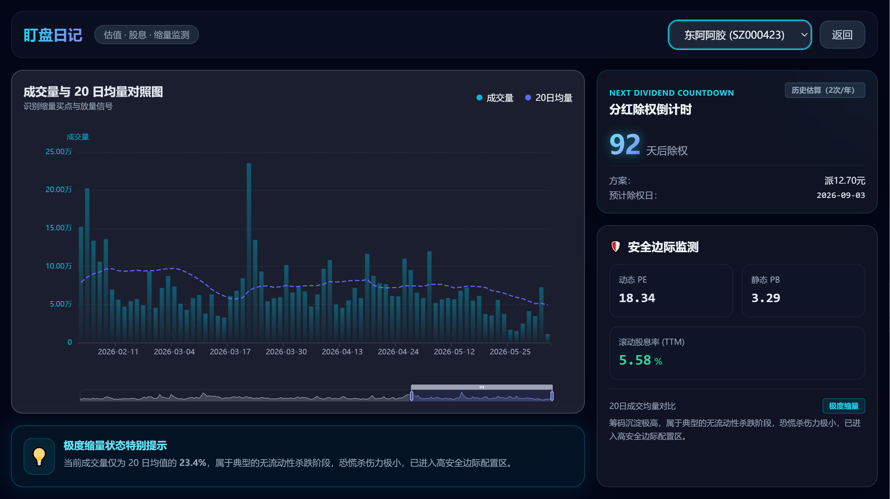

# Sentiment Monitor

面向 A 股价值投资群体的本地工作台，聚合实时行情、舆情采集、条件选股、深度估值、历史回测和财务质量分析。项目同时提供浏览器开发模式和 Windows 桌面安装包。

## 页面功能展示

| 首页看板 | 价差跟踪 | 深度分析 |
| :---: | :---: | :---: |
|  |  |  |
| **条件选股** | **工具箱** | **盯盘日记** |
|  |  |  |

## 主要功能

- 首页看板：监控股票池、实时价格、PE/PB、股息率、情绪分数、分红日历倒计时。
- 估值温度计：自选股 PB 十年水位图，圆环仪表盘展示当前 PB 在近十年历史中的百分位排名，区间条标注低估/中位/高估刻度，一眼识别低估机会。
- 智能盯盘提醒：14 种告警规则（情感、估值、热度、基本面恶化、价格目标、PE 分位、成交量异常），支持 APScheduler 定时自动检查，桌面端原生系统通知。
- 工具箱：可拖拽浮动面板 — 组合仓位+分红、复利计算器、安全边际、仓位管理、分红日历、换股计算器、凯利仓位。
- 盯盘日记：250 日成交量与 20 日均量对照图，识别缩量买点；分红除权倒计时；PE/PB/股息率安全边际卡片。
- 分红日历：首页展示所有监控股票的下一次分红时间线，三级回退（已确立/预案/历史估算）。
- 监控配置：支持搜索添加股票，维护行业和同行代码。
- 个股详情：查看单只股票的舆情、公告、研报和新闻。
- 深度分析：估值分位、F-Score、合理价值区间、投资 thesis、同行横向对比；DDM 股利折现沙盒；归一化中周期 EPS 分析。
- 股价对比：多只股票实时价格、历史价格和估值序列对比。
- 条件选股：基于本地 SQLite 快照筛选 PB、PE、ROE、ROI、股息率、市值、净现金比率、经营现金流收益率、自由现金流（FCF）收益率。
- 财务质量：现金流质量、资本配置信号、经营稳定性、资产负债表风险、股东人数趋势和财务质量矩阵。
- 桌面端：Electron + Python 后端打包，支持安装版和便携版。
- 更新与快速开始：首次打开当前版本时显示更新日志和使用教程，也可从首页右上角再次打开。

## 桌面版分发

打包产物位于：

```text
desktop/release/
```

| 文件 | 用途 | 建议 |
| --- | --- | --- |
| `SentimentMonitor-Setup-0.1.4-x64.exe` | Windows 安装包 | 推荐发给普通用户 |
| `SentimentMonitor-Portable-0.1.4-x64.exe` | 免安装便携版 | 适合临时测试 |
| `SentimentMonitor-Setup-0.1.4-x64.exe.blockmap` | 自动更新差分文件 | 当前无需单独分发 |
| `win-unpacked/` | 解包后的调试目录 | 仅用于本机调试 |

说明：

- 安装版启动速度通常优于便携版。
- 便携版启动前会先自解压，且可能被 Windows Defender 扫描，因此首次打开可能较慢。
- 未签名 exe 可能触发 Windows 安全提示。
- 桌面端默认从 `127.0.0.1:8000` 开始寻找可用端口启动内置后端，避免与本机已有服务冲突。

## 启动方式

### Windows 一键启动

```powershell
start.bat
```

脚本会启动 Django 后端、Vite 前端，并自动打开浏览器。

### 手动启动后端

```powershell
cd backend
py -3.12 -m venv venv
.\venv\Scripts\activate
pip install -r requirements.txt
python manage.py migrate
uvicorn sentiment_monitor.asgi:application --host 127.0.0.1 --port 8000
```

### 手动启动前端

```powershell
cd frontend
npm install
npm run dev
```

### 启动 Electron 开发模式

```powershell
cd desktop
npm install
npm run dev
```

## 打包 Windows exe

推荐使用项目内置脚本：

```powershell
npm.cmd --prefix desktop run check
backend\venv\Scripts\python.exe backend\manage.py check
npm.cmd --prefix desktop run dist
```

打包完成后检查产物：

```powershell
Get-ChildItem -Path desktop\release | Select-Object Name,Length,LastWriteTime
```

打包会临时生成 `frontend/dist` 和 `backend/dist/SentimentMonitor-runtime`。这些是构建中间产物，已在 `.gitignore` 中忽略，不应提交到 Git。

清理建议：

```powershell
git clean -fd -- backend/dist/SentimentMonitor-runtime frontend/dist
git status --short --untracked-files=all
```

本机已创建可复用技能 `python-exe-packager`，后续可直接让 Codex 按该流程打包 exe。

## 项目结构

```text
sentiment_monitor/
├─ backend/
│  ├─ api/                       # REST API、业务服务、缓存、测试、管理命令
│  ├─ analyzer/                  # 分析辅助模块
│  ├─ collector/                 # 新闻、公告、研报、行情采集
│  ├─ sentiment_monitor/         # Django 配置
│  ├─ desktop_backend.py         # 桌面版后端启动入口
│  ├─ desktop_backend.spec       # PyInstaller 打包配置
│  ├─ manage.py
│  ├─ requirements.txt
│  └─ db.sqlite3                  # 打包 seed 数据库
├─ desktop/                      # Electron 桌面壳和打包脚本
├─ frontend/
│  ├─ src/
│  │  ├─ api/                    # Axios API 封装
│  │  ├─ components/             # 通用组件
│  │  ├─ router/                 # Vue Router
│  │  ├─ stores/                 # Pinia 状态
│  │  └─ views/                  # 页面
│  ├─ package.json
│  └─ vite.config.ts
├─ docs/
├─ legacy/
├─ start.bat
└─ README.md
```

## 核心接口

### 股票与采集

- `GET /api/stocks/`
- `POST /api/stocks/`
- `PATCH /api/stocks/{symbol}/`
- `DELETE /api/stocks/{symbol}/`
- `POST /api/collect/`

### 行情与舆情

- `GET /api/sentiment/latest/`
- `GET /api/sentiment/today/`
- `GET /api/sentiment/realtime_prices/`
- `GET /api/sentiment/search/?q=...`
- `GET /api/sentiment/comparison_realtime/?symbols=...&type=last|minute`
- `GET /api/sentiment/comparison_historical/?symbols=...&limit=30&period=day`

### 研究分析

- `GET /api/sentiment/analysis/?symbol=SZ000001`
- `GET /api/sentiment/history-backtest/?symbol=SZ000001`
- `GET /api/sentiment/quality/?symbol=SZ000001&include_shareholder=1`
- `GET /api/sentiment/quality/shareholder-structure/?symbol=SZ000001`
- `GET /api/sentiment/quality/refresh/?symbol=SZ000001`
- `GET /api/sentiment/screener/?pb_max=1.5&pe_max=15&roe_min=12&dividend_yield_min=3`
- `POST /api/sentiment/screener/refresh/`
- `GET /api/sentiment/market-diary/?symbol=SZ000001`
- `GET /api/sentiment/dividend-calendar/`
- `GET /api/sentiment/valuation-thermometer/`

### 告警系统

- `GET /api/alerts/rules/`
- `POST /api/alerts/rules/create/`
- `DELETE /api/alerts/rules/{id}/delete/`
- `PUT /api/alerts/rules/{id}/toggle/`
- `GET /api/alerts/logs/`
- `GET /api/alerts/unread-count/`
- `POST /api/alerts/read/{id}/`
- `POST /api/alerts/read-all/`
- `POST /api/alerts/check/`
- `GET /api/alerts/notifications/`

## 最近更新

- 快照刷新 FCF 补充改后台异步：全市场选股快照的 FCF 收益率补充改为后台线程执行，刷新结果秒级返回不再阻塞 20+ 分钟；带锁防重入；熔断感知（东财阻断时立即终止本轮）；候选数硬上限 100 + 低并发 4 线程，避免请求风暴。
- 东财直连全局超时兜底：`_fetch_data_direct` 增加 90s 全局预算，8 子域名 × 55 页串行不再无限等，超时跳过并切数据源。
- 只读缓存新增 `CacheManager.peek()`：供批量补充流程使用，绝不触发网络抓取或锁竞争；`get_quality_data` 增加 `cache_only=True` 模式。
- 前端轮询进度反馈：快照刷新阶段进度通过缓存写入，前端可展示"正在抓取行情/正在计算指标/正在写入数据库"等阶段提示。
- 估值温度计修复：腾讯历史 K 线接口月线数据读取键从固定的 `qfqday` 改为按周期映射（`qfqmonth`/`qfqweek`/`qfqday`），修复非日线周期下数据被静默丢弃导致估值温度计仅显示贵州茅台的问题。
- 历史 K 线缓存中毒防护：`get_historical_data` 组合缓存写入前检查是否有标的返回空结果，有则跳过缓存写入并回退到 stale 缓存，防止外部数据源临时异常污染缓存。
- CacheManager `cache_empty` 参数完整穿透：新增参数完整传递到 `_do_fetch`，空结果时按参数决定是否写 `EMPTY_MARKER`；修复 `_fetch_without_lock` 和 `_do_fetch` 签名缺失导致的 TypeError。
- quality 接口缓存状态：`get_quality_response` 返回 `cache_status`/`background_refreshing` 字段，与 `get_ttm_fundamentals_response` 对齐。
- 性能优化：全部页面冷启动速度大幅提升。盯盘日记 5 个串行接口改为 ThreadPoolExecutor 并行获取，墙钟从 ~5s 降到 ~1s；条件选股快照刷新去掉每次删 ROE/分红缓存的逻辑，ROE 数据 3 年报期并行抓取、分红数据 8 报告期并行抓取（冷启动 ~20s → ~4s）；分析页 onMounted stocks/sentiment/analysis 改为 Promise.all 并行加载。
- 股息率来源调整：条件选股快照的股息率改为优先使用腾讯实时行情（field 49），其次雪球实时数据，最后回退到历史分红估算，不再自己算。
- 股息率计算优化：从"近1年补值"改为按价格比例推算全历史（`雪球值 × 当前价 / 历史价`），分红金额不变、收益率随价格波动，图表更准确。
- API 稳定性审计修复（14 项）：深度分析 `build_valuation_conclusion` 异常捕获；`ann_date` 字符串类型崩溃；NaN/inf JSON 序列化保护；`float()` ValueError 防护；symbol 标准化统一；盯盘日记 force 刷新缓存穿透修复；选股器轮询 stale 状态竞争修复；告警竞态条件修复；线程安全问题修复；快照刷新锁 TOCTOU 修复。
- 向量化财务计算：财务指标计算从逐行循环改为 pandas 向量化操作，性能提升；新增杜邦拆解（ROE = 净利率 × 周转率 × 权益乘数）；盯盘日记新增价格叠加图层。
- 快照刷新改异步：全市场快照刷新改为后台异步执行，前端轮询等待，不再阻塞页面；轮询超时增加反馈提示。
- 价差对冲终端修复：对比标的不再限于监控股票池，新增搜索框可添加任意股票；修复切换股票对后折线图空白的问题（ECharts 旧实例状态污染，改为每次重建）；刷新按钮带 `force` 参数绕过后端缓存；loading 动画至少显示 500ms；后端分时接口增加详细日志。
- 新增估值温度计：自选股 PB 十年水位图，每只监控股票的当前 PB 在近十年历史中的百分位排名，圆环仪表盘 + 区间条可视化，按低估程度排序。启动时自动预热，数据逐日积累。
- 新增智能盯盘提醒：扩展至 14 种告警规则（新增价格目标、PE 历史分位、成交量异常），APScheduler 每 30 分钟自动检查（工作日 9:00-16:00），Electron 桌面端原生系统通知轮询（每 5 分钟）。
- 估值温度计 API：`GET /api/sentiment/valuation-thermometer/`，返回每只监控股票的 PB 百分位、十年区间（P10/P25/P50/P75/P90）、当前值。
- 告警通知 API：`GET /api/alerts/notifications/`，供 Electron 端轮询未读告警。
- 数据源优先级重构：实时行情从东财快照优先改为腾讯优先（75ms，价格最新），东财快照降级为补字段角色。
- 雪球 F10 数据源接入：单次请求 240ms 返回 22 项指标（PE/PB/ROE/毛利率/净利率/增速/流动比率/资产负债率等）+ 最近 8 年历史趋势，作为 AkShare 财务报表的备份链路。
- 数据格式统一：`normalized_quote` 统一字段名（price/pe/pb/dividend_yield/market_cap），前端 TypeScript 类型补全。
- 启动速度优化：预热 sleep 5s→1s，实时行情最先预热，东财快照熔断机制（失败跳过 5min），HTTP 连接池预热，numpy 缓存清理。
- 盯盘日记缓存分层：历史 K 线 24h 长缓存 + 当日数据盘中 30s 短缓存，不再每次全量重取 250 天数据。
- quality 接口修复：`quality_history` 双 key 耦合消除，补全 `management_quality_summary` 字段。
- 打包版启动自动迁移：桌面端启动时自动执行 `migrate`，解决 seed 数据库缺列导致快照刷新失败的问题。
- 工具箱新增凯利仓位计算器：输入胜率和盈亏比，计算全凯利/半凯利/1/4 凯利三档仓位比例，含期望值、破产概率估算和实战建议。
- 移除集中度热力图工具。
- 快照刷新修复：`bulk_create` 加 `ignore_conflicts=True` + dict 去重，解决 UNIQUE constraint 报错。
- 行业自动回写：刷新快照时自动将行业数据填充到监控股票的 `Stock.industry` 字段（仅填空，不覆盖）。
- 首页股票卡片点击优化：去掉卡片整体点击跳转，仅底部按钮（估值分析、财务溯源、回测复盘）可跳转。
- 代码审查修复：后端 history_backtest 0 值分位被错误丢弃（`if pe_pct and` → `if pe_pct is not None and`）；前端 zoneHint 75-90 分位重复标签；bucket-chart 高度不足；并行数据获取增加异常隔离；模板深层访问增加可选链防护；InfoTooltip 改用 fixed 定位修复滚动错位；AlgorithmExplainer hint 文案跟随展开状态；7 个图表组件 safeNum 重复抽取到 `lib/chart.ts`；price_service NaN 保护；screener 分页失败增加日志。
- 财务溯源页面修复：图表横坐标 undefined 问题（后端 quality_history 缺少 year 字段）；信号摘要区域数值显示 undefined 问题（前端直接调用 .toFixed() 改为安全格式化函数）。
- 新增盯盘日记页面：250 日成交量与 20 日均量对照图、分红除权倒计时、PE/PB/股息率安全边际卡片。
- 首页情感趋势图替换为分红日历：展示所有监控股票的下一次分红时间线，支持已确立/预案/历史估算三级回退。
- 深度分析增强：新增 DDM 股利折现沙盒（可调增长率/折现率）、归一化中周期 EPS 分析、投资论点评分。
- 条件选股增强：新增净现金比率、经营现金流收益率筛选维度；支持一键刷新全市场快照。
- 财务质量增强：新增现金流质量标签、资本配置信号、资产负债表风险评级、经营稳定性/护城河/周期性标签。
- 快照抓取重构：新增直连东方财富 API（多子域名容错 + 绕过 Windows 系统代理），AkShare 兜底，新浪接口为最终后备。
- 启动缓存预热升级：3 阶段串行预热（快照/TTM → 估值分析+回测 → 财务质量），避免冷启动时首次访问慢。
- 采集脚本修复：`_normalize_text` 函数定义提升到调用点之前，修复研报评分为空时的潜在报错。
- 后端缓存防御：所有 `cache.get` 调用增加 pickle 反序列化异常捕获，pandas 版本升级不再导致服务崩溃。
- SQLite 配置优化：WAL 模式 + busy_timeout=5000，解决并发写入锁冲突。
- 定时任务保护：scheduler 启动延迟 1 小时执行，避免 misfire 导致启动时批量采集。
- 便携版分发文件名从 `0.1.0` 更新到 `0.1.4`。

## 数据同步

### 同步脚本

项目提供两种同步脚本：

| 脚本 | 说明 | 适用场景 |
|------|------|----------|
| `sync_all_data` | 串行同步，稳定可靠 | 日常使用、首次同步 |
| `sync_all_data_parallel` | 并行同步，速度更快 | 多只股票、追求效率 |

### 串行同步（推荐）

```powershell
cd backend
.\venv\Scripts\activate
python manage.py sync_all_data
```

### 并行同步

```powershell
cd backend
.\venv\Scripts\activate
python manage.py sync_all_data_parallel --workers 3
```

### 同步内容

同步脚本会依次执行以下步骤：

1. **监控池采集** - 舆情/公告/研报
2. **选股快照** - 全市场 PE/PB/ROE/股息率
3. **缓存预热** - 每只监控股票的完整数据：
   - TTM 基本面、现金流
   - 雪球 F10（ROE/毛利率/增长率）
   - 北向持仓、股东结构
   - 财务质量、F-Score、前瞻指标
   - 深度分析、历史回测
   - 实时行情

### 常用参数

- `--skip-collector`：跳过监控池新闻/公告/研报采集。
- `--skip-screener`：跳过全市场选股快照刷新。
- `--skip-quality`：跳过财务质量缓存预热。
- `--with-shareholder`：财务预热时拉取股东结构数据（耗时更长）。
- `--workers N`：并行同步的线程数（默认 3，仅 `sync_all_data_parallel`）。

### 只执行采集

```powershell
cd backend
.\venv\Scripts\activate
python manage.py run_collector
```

### 定时任务

项目已内置 APScheduler 定时任务：

| 任务 | 频率 | 说明 |
|------|------|------|
| 舆情采集 | 每小时 | 自动采集新闻/公告/研报 |
| 快照刷新 | 每小时 | 更新 PE/PB/市值缓存 |
| 告警检查 | 每30分钟 | 检查告警规则（工作日 9:00-16:00） |

如需额外定时同步，可配置系统任务计划：

```powershell
# Windows 任务计划程序 - 每天凌晨 2 点执行
schtasks /create /tn "SentimentSync" /tr "cd D:\code\git\sentiment_monitor\backend && python manage.py sync_all_data_parallel --workers 3" /sc daily /st 02:00
```

## 数据链路与容灾

系统对每个数据字段都设计了多级回退链路，确保单一数据源故障时仍能正常展示。

### 实时行情 (`get_realtime_price`)

腾讯行情优先（75ms，价格最新），东财快照补字段，雪球 F10 兜底：

```
① 腾讯 qt.gtimg.cn                    → price, pe, pb, dividend_yield, market_cap (最快最新)
② 东方财富快照 (spot_snapshot 缓存)     → 补缺失字段 (pe, pb, market_cap，不覆盖价格)
③ last_success 缓存                   → 全字段 (上次成功的完整数据)
④ 雪球 F10 (quote + indicator)         → 全字段 (含 ROE/毛利率/增速等深度指标)
⑤ 新浪 akshare                        → 仅补仍缺失的标的 (仅 price)
⑥ 缓存合并                            → 用历史缓存补全缺失字段
⑦ 雪球 API (8 并发)                   → dividend_yield (始终执行)
⑧ StockScreenerSnapshot DB            → pe, pb, dy, market_cap (最终兜底)
⑨ TTM 基本面重算 (fetch_fundamentals=True 时) → pe, pb (详情页用)
```

各字段数据源优先级：

| 字段 | ① | ② | ③ | ④ | ⑤ |
|------|---|---|---|---|---|
| price | 腾讯实时 | 东方财富快照 | last_success 缓存 | 雪球 F10 | 新浪 akshare |
| pe | 腾讯实时 | 东方财富快照 | 雪球 F10 | ScreenerSnapshot DB | TTM 重算 |
| pb | 腾讯实时 | 东方财富快照 | 雪球 F10 | ScreenerSnapshot DB | TTM 重算 |
| dividend_yield | 雪球 API | 腾讯实时 | last_success 缓存 | ScreenerSnapshot DB | — |
| market_cap | 腾讯实时 | 东方财富快照 | 雪球 F10 | ScreenerSnapshot DB | — |

快照缓存策略：1 小时新鲜缓存 + 24 小时 stale 存档，东方财富维护期间仍可用旧数据。东财快照加熔断机制，连续失败后跳过 5 分钟。

### 分时数据 (`get_intraday_data`)

```
① 本日缓存 (key 含当日日期，不会读到昨天数据)
② 腾讯 ifzq.gtimg.cn (分钟线)
③ 新浪 akshare stock_zh_a_minute (仅当日，经 _normalize_intraday_time 归一化为 HHMM)
④ stale 缓存 (7 天有效)
```

### 历史 K 线 (`get_historical_data`)

```
① 组合缓存
② 单标的缓存
③ 腾讯 web.ifzq.gtimg.cn (不复权 K 线，支持增量更新)
④ Baostock (本地 provider，离线可用)
⑤ stale 缓存 (7 天有效)
```

历史数据的估值注入（pe/pb/dy 序列）依赖 `FundamentalService` (东方财富)，兜底为等比例缩放当前估值。

### 外部依赖一览

| 数据源 | 用途 | 类型 |
|--------|------|------|
| 腾讯 qt.gtimg.cn | 实时行情（价格/PE/PB/市值） | HTTP |
| 腾讯 ifzq.gtimg.cn | 分时 + 历史 K 线 | HTTP |
| 腾讯 web.ifzq.gtimg.cn | 历史 K 线 | HTTP |
| 东方财富 emweb (akshare) | 财务报表 → TTM PE/PB | HTTPS |
| 东方财富 spot_em (akshare) | 全A股快照（带熔断） | HTTPS |
| 雪球 API | 股息率 + F10 深度指标（ROE/毛利率/增速等） | HTTPS |
| 新浪 (akshare) | 实时/分时价格兜底 | HTTP |
| Baostock | 历史 K 线兜底 | 本地 |
| StockScreenerSnapshot | 估值字段最终兜底 | SQLite |

### 时间格式归一化

分时数据统一为 `HHMM` 四位数字格式（如 `0930`、`1355`），通过 `_normalize_intraday_time` 兼容各数据源：

| 数据源 | 原始格式 | 归一化结果 |
|--------|---------|-----------|
| 腾讯 | `0930` | `0930` |
| 新浪/akshare | `09:30` 或 `2026-06-04 09:30:00` | `0930` |

## 缓存与性能

- 首页加载优化：实时行情走腾讯优先（75ms），不走重试等待；分红日历异步加载不阻塞首屏；雪球股息率 8 并发获取。
- 启动速度优化：预热 sleep 从 5s 降到 1s；实时行情最先预热；东财快照加熔断（失败跳过 5 分钟）；HTTP 连接池启动时预热；numpy 不兼容缓存启动时清理。
- 缓存预热覆盖首页关键接口：启动时自动预热实时价格和分红日历缓存。
- 快照缓存双层 TTL：1h 新鲜 + 24h stale 存档，外部数据源维护期间不丢数据。
- 盯盘日记分层缓存：历史 K 线 24h（不会变）；当日数据盘中 30s / 收盘后 1h；分红倒计时 6h。
- 深度分析缓存会优先返回已有结果，后台再刷新最新结果。
- 条件选股使用本地 SQLite 快照，避免每次筛选都拉取全市场数据。
- 财务质量和股东结构分开缓存，减少整页阻塞。
- 桌面打包模式默认关闭启动预热，减少打开时等待。
- 首次冷启动、缓存失效或外部数据源较慢时，请等待后台加载完成。

## 常见问题

### 打开提示 `Frontend build not found`

请重新打包：

```powershell
npm.cmd --prefix desktop run dist
```

### 打开后黑屏

请确认使用最新安装包。桌面包在 `file://` 场景下应使用 Hash 路由，地址类似：

```text
file:///.../resources/app.asar/frontend-dist/index.html#/
```

### 便携版启动慢

便携版需要先自解压到临时目录，还可能被系统安全软件扫描。正式分发建议使用 `SentimentMonitor-Setup-0.1.4-x64.exe`。

### 新增股票后旧股票不见了

该问题已修复。`latest` 接口现在按每只股票返回各自最新数据，不再使用单一全局日期过滤。

### 股价对比页面无数据

该问题已随 `latest` 接口修复。对比页面会基于最新的监控股票数据提供候选标的。

## 测试与检查

后端检查：

```powershell
backend\venv\Scripts\python.exe backend\manage.py check
```

后端测试：

```powershell
cd backend
python manage.py test api.tests api.tests_analysis_cache api.tests_sync_command
```

前端构建：

```powershell
npm.cmd --prefix frontend run build
```

桌面脚本检查：

```powershell
npm.cmd --prefix desktop run check
```

桌面打包：

```powershell
npm.cmd --prefix desktop run dist
```

## 已知事项

- 当前 exe 未签名，可能被 Windows 安全策略提示风险。
- Vite 构建可能提示 ECharts chunk 较大，不影响运行。
- Electron + Python + Django + pandas/numpy/akshare/playwright 的组合会让安装包体积较大。
- 外部数据源偶发慢响应或限流时，部分分析接口可能需要更久。

## 许可

当前仓库未单独声明开源许可证。如需公开发布，建议补充 `LICENSE`。
