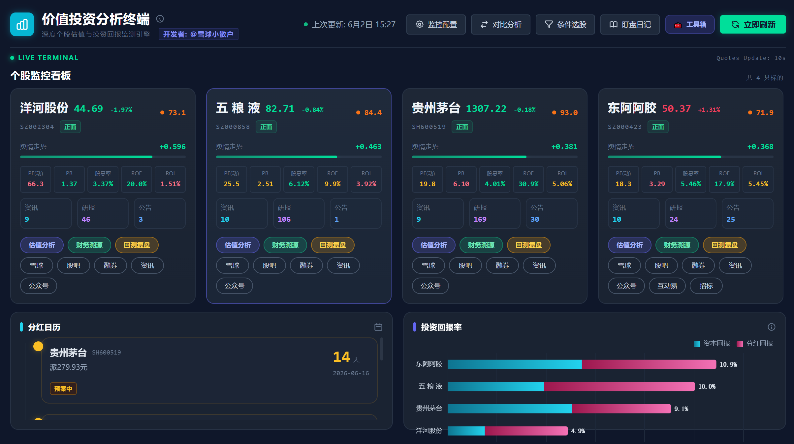
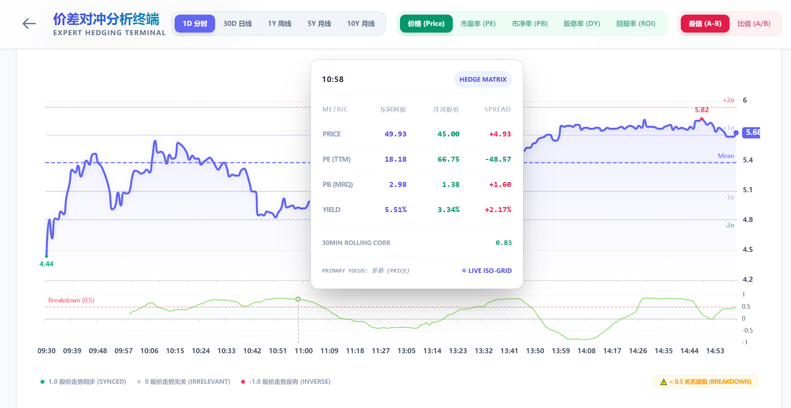
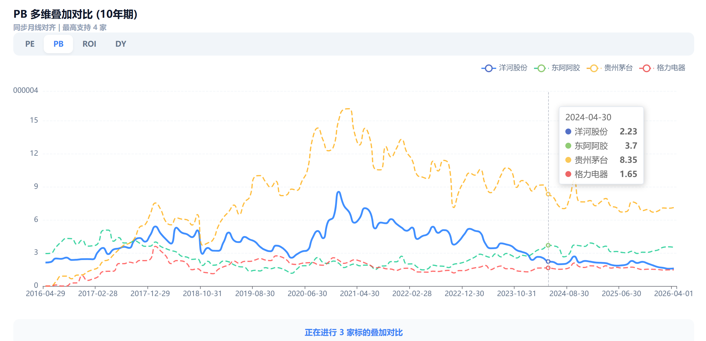
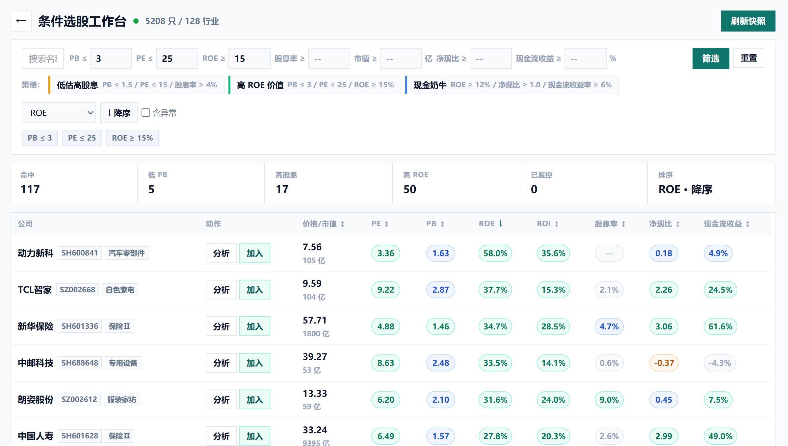
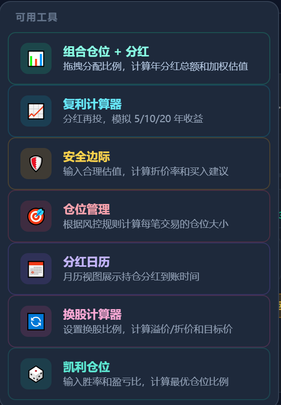

# Sentiment Monitor

面向 A 股价值投资群体的本地工作台，聚合实时行情、舆情采集、条件选股、深度估值、历史回测和财务质量分析。项目同时提供浏览器开发模式和 Windows 桌面安装包。

## 页面功能展示

| 首页看板 | 价差跟踪 | 深度分析 |
| :---: | :---: | :---: |
|  |  |  |
| **条件选股** | **工具箱** | |
|  |  | |

## 主要功能

- 首页看板：监控股票池、实时价格、PE/PB、股息率、情绪分数、分红日历倒计时。
- 工具箱：可拖拽浮动面板 — 组合仓位+分红、复利计算器、安全边际、仓位管理、分红日历、换股计算器、凯利仓位。
- 盯盘日记：250 日成交量与 20 日均量对照图，识别缩量买点；分红除权倒计时；PE/PB/股息率安全边际卡片。
- 分红日历：首页展示所有监控股票的下一次分红时间线，三级回退（已确立/预案/历史估算）。
- 监控配置：支持搜索添加股票，维护行业和同行代码。
- 个股详情：查看单只股票的舆情、公告、研报和新闻。
- 深度分析：估值分位、F-Score、合理价值区间、投资 thesis、同行横向对比；DDM 股利折现沙盒；归一化中周期 EPS 分析。
- 股价对比：多只股票实时价格、历史价格和估值序列对比。
- 条件选股：基于本地 SQLite 快照筛选 PB、PE、ROE、ROI、股息率、市值、净现金比率、经营现金流收益率。
- 财务质量：现金流质量、资本配置信号、经营稳定性、资产负债表风险、股东人数趋势和财务质量矩阵。
- 桌面端：Electron + Python 后端打包，支持安装版和便携版。
- 更新与快速开始：首次打开当前版本时显示更新日志和使用教程，也可从首页右上角再次打开。

## 桌面版分发

打包产物位于：

```text
desktop/release/
```

| 文件 | 用途 | 建议 |
| --- | --- | --- |
| `SentimentMonitor-Setup-0.1.4-x64.exe` | Windows 安装包 | 推荐发给普通用户 |
| `SentimentMonitor-Portable-0.1.4-x64.exe` | 免安装便携版 | 适合临时测试 |
| `SentimentMonitor-Setup-0.1.4-x64.exe.blockmap` | 自动更新差分文件 | 当前无需单独分发 |
| `win-unpacked/` | 解包后的调试目录 | 仅用于本机调试 |

说明：

- 安装版启动速度通常优于便携版。
- 便携版启动前会先自解压，且可能被 Windows Defender 扫描，因此首次打开可能较慢。
- 未签名 exe 可能触发 Windows 安全提示。
- 桌面端默认从 `127.0.0.1:8000` 开始寻找可用端口启动内置后端，避免与本机已有服务冲突。

## 启动方式

### Windows 一键启动

```powershell
start.bat
```

脚本会启动 Django 后端、Vite 前端，并自动打开浏览器。

### 手动启动后端

```powershell
cd backend
py -3.12 -m venv venv
.\venv\Scripts\activate
pip install -r requirements.txt
python manage.py migrate
uvicorn sentiment_monitor.asgi:application --host 127.0.0.1 --port 8000
```

### 手动启动前端

```powershell
cd frontend
npm install
npm run dev
```

### 启动 Electron 开发模式

```powershell
cd desktop
npm install
npm run dev
```

## 打包 Windows exe

推荐使用项目内置脚本：

```powershell
npm.cmd --prefix desktop run check
backend\venv\Scripts\python.exe backend\manage.py check
npm.cmd --prefix desktop run dist
```

打包完成后检查产物：

```powershell
Get-ChildItem -Path desktop\release | Select-Object Name,Length,LastWriteTime
```

打包会临时生成 `frontend/dist` 和 `backend/dist/SentimentMonitor-runtime`。这些是构建中间产物，已在 `.gitignore` 中忽略，不应提交到 Git。

清理建议：

```powershell
git clean -fd -- backend/dist/SentimentMonitor-runtime frontend/dist
git status --short --untracked-files=all
```

本机已创建可复用技能 `python-exe-packager`，后续可直接让 Codex 按该流程打包 exe。

## 项目结构

```text
sentiment_monitor/
├─ backend/
│  ├─ api/                       # REST API、业务服务、缓存、测试、管理命令
│  ├─ analyzer/                  # 分析辅助模块
│  ├─ collector/                 # 新闻、公告、研报、行情采集
│  ├─ sentiment_monitor/         # Django 配置
│  ├─ desktop_backend.py         # 桌面版后端启动入口
│  ├─ desktop_backend.spec       # PyInstaller 打包配置
│  ├─ manage.py
│  ├─ requirements.txt
│  └─ db.sqlite3                  # 打包 seed 数据库
├─ desktop/                      # Electron 桌面壳和打包脚本
├─ frontend/
│  ├─ src/
│  │  ├─ api/                    # Axios API 封装
│  │  ├─ components/             # 通用组件
│  │  ├─ router/                 # Vue Router
│  │  ├─ stores/                 # Pinia 状态
│  │  └─ views/                  # 页面
│  ├─ package.json
│  └─ vite.config.ts
├─ docs/
├─ legacy/
├─ start.bat
└─ README.md
```

## 核心接口

### 股票与采集

- `GET /api/stocks/`
- `POST /api/stocks/`
- `PATCH /api/stocks/{symbol}/`
- `DELETE /api/stocks/{symbol}/`
- `POST /api/collect/`

### 行情与舆情

- `GET /api/sentiment/latest/`
- `GET /api/sentiment/today/`
- `GET /api/sentiment/realtime_prices/`
- `GET /api/sentiment/search/?q=...`
- `GET /api/sentiment/comparison_realtime/?symbols=...&type=last|minute`
- `GET /api/sentiment/comparison_historical/?symbols=...&limit=30&period=day`

### 研究分析

- `GET /api/sentiment/analysis/?symbol=SZ000001`
- `GET /api/sentiment/history-backtest/?symbol=SZ000001`
- `GET /api/sentiment/quality/?symbol=SZ000001&include_shareholder=1`
- `GET /api/sentiment/quality/shareholder-structure/?symbol=SZ000001`
- `GET /api/sentiment/quality/refresh/?symbol=SZ000001`
- `GET /api/sentiment/screener/?pb_max=1.5&pe_max=15&roe_min=12&dividend_yield_min=3`
- `POST /api/sentiment/screener/refresh/`
- `GET /api/sentiment/market-diary/?symbol=SZ000001`
- `GET /api/sentiment/dividend-calendar/`

## 最近更新

- 打包版启动自动迁移：桌面端启动时自动执行 `migrate`，解决 seed 数据库缺列导致快照刷新失败的问题。
- 工具箱新增凯利仓位计算器：输入胜率和盈亏比，计算全凯利/半凯利/1/4 凯利三档仓位比例，含期望值、破产概率估算和实战建议。
- 移除集中度热力图工具。
- 快照刷新修复：`bulk_create` 加 `ignore_conflicts=True` + dict 去重，解决 UNIQUE constraint 报错。
- 行业自动回写：刷新快照时自动将行业数据填充到监控股票的 `Stock.industry` 字段（仅填空，不覆盖）。
- 首页股票卡片点击优化：去掉卡片整体点击跳转，仅底部按钮（估值分析、财务溯源、回测复盘）可跳转。
- 代码审查修复：后端 history_backtest 0 值分位被错误丢弃（`if pe_pct and` → `if pe_pct is not None and`）；前端 zoneHint 75-90 分位重复标签；bucket-chart 高度不足；并行数据获取增加异常隔离；模板深层访问增加可选链防护；InfoTooltip 改用 fixed 定位修复滚动错位；AlgorithmExplainer hint 文案跟随展开状态；7 个图表组件 safeNum 重复抽取到 `lib/chart.ts`；price_service NaN 保护；screener 分页失败增加日志。
- 财务溯源页面修复：图表横坐标 undefined 问题（后端 quality_history 缺少 year 字段）；信号摘要区域数值显示 undefined 问题（前端直接调用 .toFixed() 改为安全格式化函数）。
- 新增盯盘日记页面：250 日成交量与 20 日均量对照图、分红除权倒计时、PE/PB/股息率安全边际卡片。
- 首页情感趋势图替换为分红日历：展示所有监控股票的下一次分红时间线，支持已确立/预案/历史估算三级回退。
- 深度分析增强：新增 DDM 股利折现沙盒（可调增长率/折现率）、归一化中周期 EPS 分析、投资论点评分。
- 条件选股增强：新增净现金比率、经营现金流收益率筛选维度；支持一键刷新全市场快照。
- 财务质量增强：新增现金流质量标签、资本配置信号、资产负债表风险评级、经营稳定性/护城河/周期性标签。
- 快照抓取重构：新增直连东方财富 API（多子域名容错 + 绕过 Windows 系统代理），AkShare 兜底，新浪接口为最终后备。
- 启动缓存预热升级：3 阶段串行预热（快照/TTM → 估值分析+回测 → 财务质量），避免冷启动时首次访问慢。
- 采集脚本修复：`_normalize_text` 函数定义提升到调用点之前，修复研报评分为空时的潜在报错。
- 后端缓存防御：所有 `cache.get` 调用增加 pickle 反序列化异常捕获，pandas 版本升级不再导致服务崩溃。
- SQLite 配置优化：WAL 模式 + busy_timeout=5000，解决并发写入锁冲突。
- 定时任务保护：scheduler 启动延迟 1 小时执行，避免 misfire 导致启动时批量采集。
- 便携版分发文件名从 `0.1.0` 更新到 `0.1.4`。

## 数据同步

全量同步：

```powershell
cd backend
.\venv\Scripts\activate
python manage.py sync_all_data
```

只执行监控池舆情采集：

```powershell
cd backend
.\venv\Scripts\activate
python manage.py run_collector
```

常用参数：

- `--skip-collector`：跳过监控池新闻/公告/研报采集。
- `--skip-screener`：跳过全市场选股快照刷新。
- `--skip-quality`：跳过财务质量缓存预热。
- `--with-shareholder`：财务预热时拉取股东结构数据。

## 缓存与性能

- 深度分析缓存会优先返回已有结果，后台再刷新最新结果。
- 条件选股使用本地 SQLite 快照，避免每次筛选都拉取全市场数据。
- 财务质量和股东结构分开缓存，减少整页阻塞。
- 桌面打包模式默认关闭启动预热，减少打开时等待。
- 首次冷启动、缓存失效或外部数据源较慢时，请等待后台加载完成。

## 常见问题

### 打开提示 `Frontend build not found`

请重新打包：

```powershell
npm.cmd --prefix desktop run dist
```

### 打开后黑屏

请确认使用最新安装包。桌面包在 `file://` 场景下应使用 Hash 路由，地址类似：

```text
file:///.../resources/app.asar/frontend-dist/index.html#/
```

### 便携版启动慢

便携版需要先自解压到临时目录，还可能被系统安全软件扫描。正式分发建议使用 `SentimentMonitor-Setup-0.1.4-x64.exe`。

### 新增股票后旧股票不见了

该问题已修复。`latest` 接口现在按每只股票返回各自最新数据，不再使用单一全局日期过滤。

### 股价对比页面无数据

该问题已随 `latest` 接口修复。对比页面会基于最新的监控股票数据提供候选标的。

## 测试与检查

后端检查：

```powershell
backend\venv\Scripts\python.exe backend\manage.py check
```

后端测试：

```powershell
cd backend
python manage.py test api.tests api.tests_analysis_cache api.tests_sync_command
```

前端构建：

```powershell
npm.cmd --prefix frontend run build
```

桌面脚本检查：

```powershell
npm.cmd --prefix desktop run check
```

桌面打包：

```powershell
npm.cmd --prefix desktop run dist
```

## 已知事项

- 当前 exe 未签名，可能被 Windows 安全策略提示风险。
- Vite 构建可能提示 ECharts chunk 较大，不影响运行。
- Electron + Python + Django + pandas/numpy/akshare/playwright 的组合会让安装包体积较大。
- 外部数据源偶发慢响应或限流时，部分分析接口可能需要更久。

## 许可

当前仓库未单独声明开源许可证。如需公开发布，建议补充 `LICENSE`。
